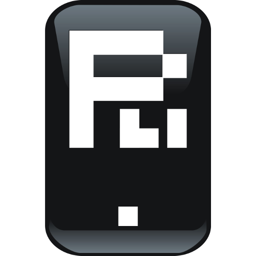

# Criando um NFT na Prática

O NFT foi criado na rede testnet da OpenSea.

Abaixo está o link para visuálizá-lo:
- https://testnets.opensea.io/assets/amoy/0xc6dda622dd93df436bd32b031513e8aa37311468/1/

